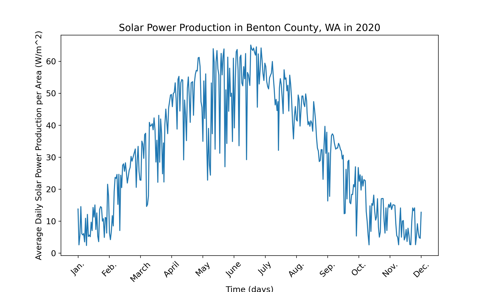

# Solar Project MVP

The goal of this project is to provide users with a dashboard to estimate the annual power they might produce from solar panels were they to install them on their
home/business. This is an example of a plot that would populate on the dashboard when a user input their county.

Moving forward, I will put this on a website that takes user inputs and add more outputs like the annual sum of power produced and averages for each season. I also
will need to move the data into a database to fulfill the database requirement.
