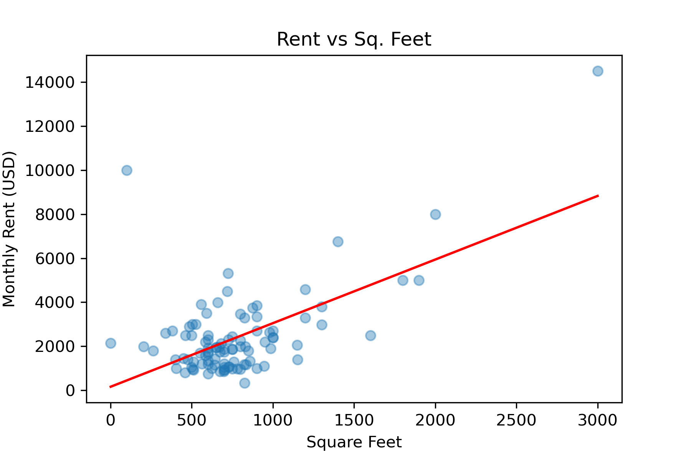

# Apartment Rent Predictor

### Question
How much will an apartment rent for based on its square footage, number of bedrooms and bathrooms, location (city, state), distance from nearby colleges and airports, etc?

### Preliminary Results
I have scraped data from apartments.com and found the following relationships between XXXXXX and monthly rent.
