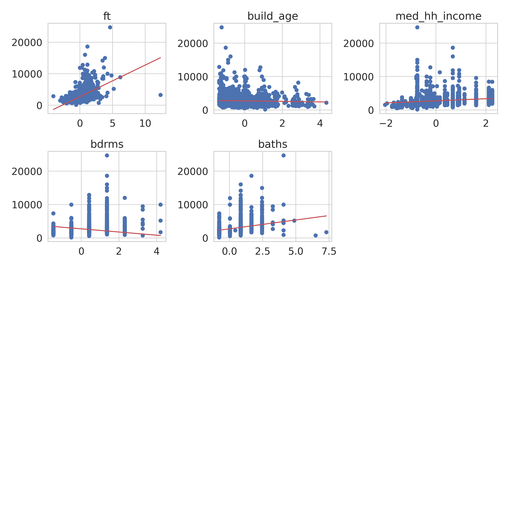

# Apartment Rent Predictor

### Question
How much will an apartment rent for based on its square footage, number of bedrooms and bathrooms, etc?

### Preliminary Results
I have scraped 8000 apartments so far from apartments.com and found these correlations with monthly rent. My current validation R^2 is 0.34. Going forward I plan to include location, distance to nearby airports and schools, and common ammenities like A/C and whether or not pets are allowed, do more feature engineering, and use box-cox to normalize the rent variable.
