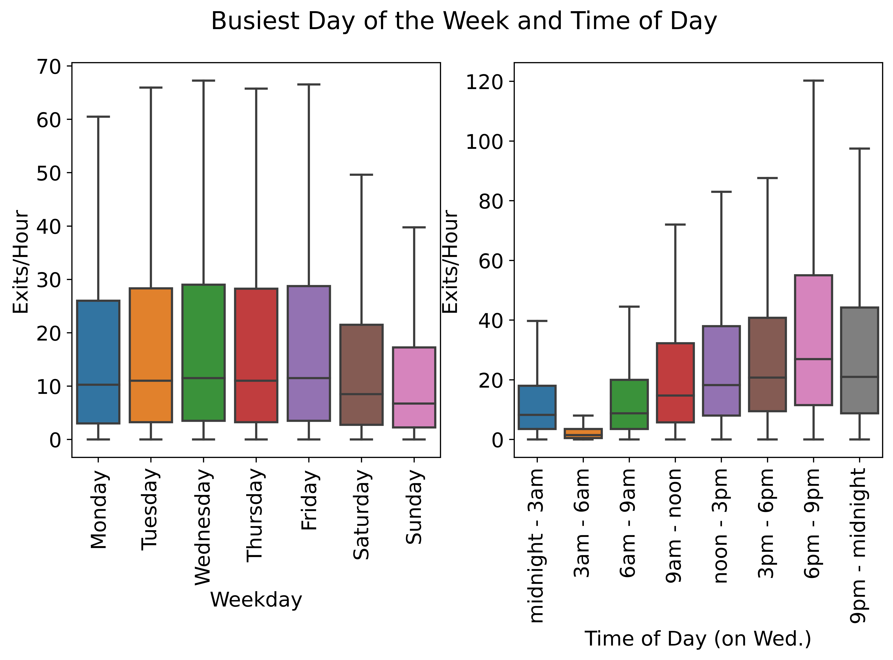
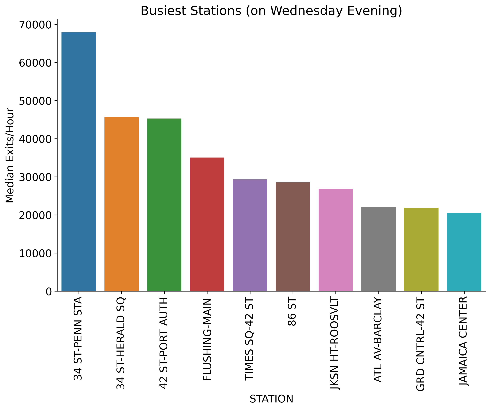

# MTA Project MVP

### Goal:  Identify street team setup locations which maximize foot traffic

**Procedure:** I differentiated the turnstile data to collect the exits/hour for each turnstile. Then I used exits/hour as the metric for foot traffic which I then attempted to maximize using the following factors: day of the week, time of day, and station.

**(left)** According to the data above, the busiest days of the week are weekdays with Monday being the least busy weekday. This makes sense intuitively as work days should see the most commuters and mondays are more likely to be taken off than weekdays in the middle of the week like Wednesday. **(right)** 6-9pm appears to be the busiest time period which corresponds with the post work rush. Interestingly, there are relatively few exits/hour during the morning rush which should be between 6am and 9am. This is cause for alarm and will be investigated.

The busiest stations when ranked by median exits/hour are shown above. A quick google search of busiest new york subway stations mostly agrees with this ranking which provides some confidence that the procedure I used to measure foot traffic is relatively accurate and robust to any outliers remaining in the data after cleaning.

### Current Takeaways
- Street teams should operate on a weekday that is not Monday to maximize foot traffic
- Street teams should operate during the evening rush (6pm-9pm) to maximize foot traffic
- Street teams should operate at the stations in the Busiest Stations figure to maximize foot traffic

### Questions Still Pending
- Why does my data not show a morning rush?
- How many street teams are needed per station to fully cover it?
- Which turnstile bays are the most busy within each station? (related to previous question)
